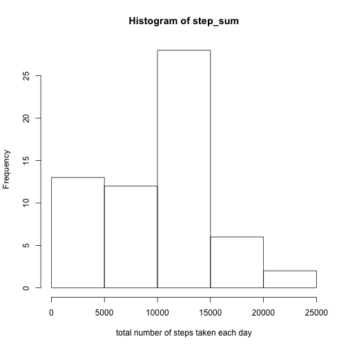
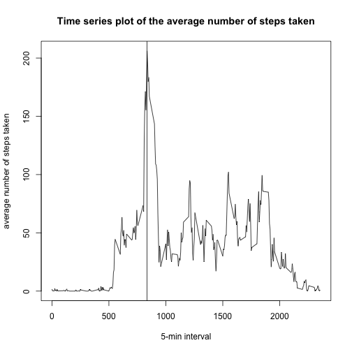
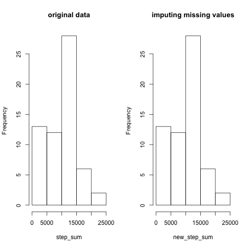
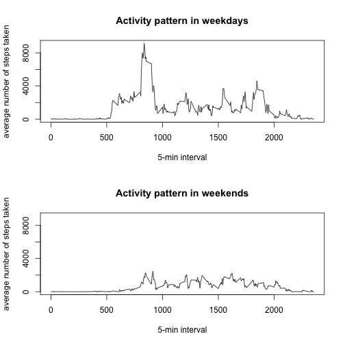

## Loading and preprocessing the data

```r
    act_data <- read.csv("activity.csv",sep=",", stringsAsFactor=FALSE)
    step_sum <- with(act_data, tapply(steps, date, sum, na.rm=TRUE))
```

## What is mean total number of steps taken per day?

```r
    hist(step_sum, xlab="total number of steps taken each day")
```



## What is the average daily activity pattern?

```r
    mean_step <- mean(step_sum, na.rm=TRUE)
    median_step <- median(step_sum, na.rm=TRUE)
    print(paste("mean of total number of steps taken each day is: ", mean_step))
```

```
## [1] "mean of total number of steps taken each day is:  9354.22950819672"
```

```r
    print(paste("median of total number of steps taken each day is: ", median_step))
```

```
## [1] "median of total number of steps taken each day is:  10395"
```

```r
    # step 4,5: time series plot of the average number of steps taken
    five_step_avg <- with(act_data, tapply(steps, interval, mean, na.rm=TRUE))
    plot(names(five_step_avg), five_step_avg, type="l", xlab="5-min interval",
         ylab="average number of steps taken", 
         main="Time series plot of the average number of steps taken")
    max_time <- which(five_step_avg==max(five_step_avg, na.rm=TRUE))
    abline(v=names(five_step_avg[max_time]))
```



```r
    print(paste(names(max_time), "contains the max num of steps",
                five_step_avg[max_time]))
```

```
## [1] "835 contains the max num of steps 206.169811320755"
```

## Imputing missing values

```r
    # let's see how many NAs are there
    total_na_step <- sum(is.na(act_data$steps))
    print(paste("Total number of missing values in the dataset is: ",total_na_step))
```

```
## [1] "Total number of missing values in the dataset is:  2304"
```

```r
    # set the NAs = mean of that date
    step_avg <- with(act_data, tapply(steps, date, mean, na.rm=TRUE))
    step_avg[is.na(step_avg)] <- 0
    step_na <- is.na(act_data$steps)
    step_na_date <- act_data$date[step_na]
    # all the NAs have been replaced by the corresponding daily average values
    new_act_data <- act_data
    new_act_data$steps[step_na] <- step_avg[step_na_date]
    # make the histogram, mean and median again
    new_step_sum <- with(new_act_data, tapply(steps, date, sum, na.rm=TRUE))
    new_mean_step <- mean(new_step_sum, na.rm=TRUE)
    new_median_step <- median(new_step_sum, na.rm=TRUE)
    print(paste("After imputing missing values, mean of total number of steps taken each day is: ", new_mean_step))
```

```
## [1] "After imputing missing values, mean of total number of steps taken each day is:  9354.22950819672"
```

```r
    print(paste("After imputing missing values, median of total number of steps taken each day is: ", new_median_step))
```

```
## [1] "After imputing missing values, median of total number of steps taken each day is:  10395"
```

```r
    par(mfrow=c(1,2))
    hist(step_sum, main="original data")
    hist(new_step_sum, main="imputing missing values")
```



## Are there differences in activity patterns between weekdays and weekends?

```r
    # create a new factor variable in the dataset with 2 levels : weekday
    # and weekend
    week <- c("weekday","weekday","weekday","weekday","weekday","weekend","weekend")
    names(week) <- c("Monday","Tuesday","Wednesday","Thursday","Friday","Saturday","Sunday")
    act_data$week <- week[weekdays(as.Date(act_data$date))]
    weekday_act_data <- subset(act_data, week=="weekday")
    weekend_act_data <- subset(act_data, week=="weekend")
    weekday_step <- with(weekday_act_data, tapply(steps, interval, sum, 
                                                  na.rm=TRUE))
    weekend_step <- with(weekend_act_data, tapply(steps, interval, sum, 
                                                  na.rm=TRUE))
    par(mfrow=c(2,1))
    rng <- range(weekend_step, weekday_step)
    plot(names(weekday_step), weekday_step, type="l", xlab="5-min interval",
         ylab="average number of steps taken",ylim=rng,
         main="Activity pattern in weekdays")
    plot(names(weekend_step), weekend_step, type="l", xlab="5-min interval",
         ylab="average number of steps taken", ylim=rng,
         main="Activity pattern in weekends")
```


